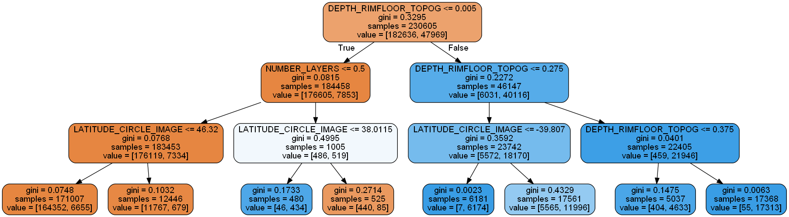
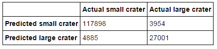

# Mars craters decision tree

[Codebook for data used](data/Mars_Crater_Codebook.pdf)

[Data file](data/marscrater_pds.csv)

Decision tree analysis was performed on the Mars craters dataset to test nonlinear relationships among a series of explanatory variables and a binary, categorical response variable. To reduce overfit, and as python scikit-learn does not currently implement pruning, the classifier was constrained to a maximum depth of `3`, with minimum number of samples per split of `200` and also minimum samples per leaf of `200`.

The classification tree model here is evaluating *whether or not a crater is large (greater than 3 km in diameter)* as the target called `LARGE_DIAM`. Explanatory variables were included as possible contributors: latitude (`LATITUDE_CIRCLE_IMAGE`), longitude (`LONGITUDE_CIRCLE_IMAGE`), crater depth (`DEPTH_RIMFLOOR_TOPOG`), and number of layers (`NUMBER_LAYERS`).

*Crater depth* was the first variable to separate the sample into two subgroups. Craters with a depth *less than or equal to 5 metres* were more likely to have a *small crater diameter* (that is, a crater smaller than 3 km across).

This was true for most of the cases except if the *number of layers was more than one* and the *latitude was less than or equal to 38.0115* where a series of splits pointed towards that being more likely a *large* crater.

For craters with *depth more than 5 metres*, they were most likely also craters with a *large* diameter (3 km or more across).

Even with the substantial constraints on this tree, there were still nodes and leaves that could have probably been pruned away as they didn’t add much to the classification ability of the model. For example, once you know the depth of a crater is more than 5 metres, the model continues you to point you towards it being a large crater regardless of more splits, and most of the time craters less than 5 metres in depth will be small craters in diameter. It is only the curious shallow craters with layers and latitude less than or equal to 38.0015 that the model suggests a large diameter crater despite the shallow depth. Perhaps this is terrain related.

The confusion matrix looks like this:

The code used can be found at: [Mars craters decision tree](mars_craters_decision_tree.ipynb)
