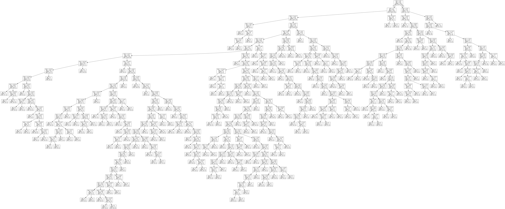

# Running a decision tree


```python
# -*- coding: utf-8 -*-

from pandas import Series, DataFrame
from pandas import *
import numpy as np
import os
import matplotlib.pylab as plt
from sklearn.cross_validation import train_test_split
from sklearn.tree import DecisionTreeClassifier
from sklearn.metrics import classification_report
import sklearn.metrics

#Load the dataset
data = read_csv("data/marscrater_pds.csv")
data.dropna(inplace=True)
data.head()
```


<div>
<table border="1" class="dataframe">
  <thead>
    <tr style="text-align: right;">
      <th></th>
      <th>CRATER_ID</th>
      <th>CRATER_NAME</th>
      <th>LATITUDE_CIRCLE_IMAGE</th>
      <th>LONGITUDE_CIRCLE_IMAGE</th>
      <th>DIAM_CIRCLE_IMAGE</th>
      <th>DEPTH_RIMFLOOR_TOPOG</th>
      <th>MORPHOLOGY_EJECTA_1</th>
      <th>MORPHOLOGY_EJECTA_2</th>
      <th>MORPHOLOGY_EJECTA_3</th>
      <th>NUMBER_LAYERS</th>
    </tr>
  </thead>
  <tbody>
    <tr>
      <th>0</th>
      <td>01-000000</td>
      <td></td>
      <td>84.367</td>
      <td>108.746</td>
      <td>82.10</td>
      <td>0.22</td>
      <td></td>
      <td></td>
      <td></td>
      <td>0</td>
    </tr>
    <tr>
      <th>1</th>
      <td>01-000001</td>
      <td>Korolev</td>
      <td>72.760</td>
      <td>164.464</td>
      <td>82.02</td>
      <td>1.97</td>
      <td>Rd/MLERS</td>
      <td>HuBL</td>
      <td></td>
      <td>3</td>
    </tr>
    <tr>
      <th>2</th>
      <td>01-000002</td>
      <td></td>
      <td>69.244</td>
      <td>-27.240</td>
      <td>79.63</td>
      <td>0.09</td>
      <td></td>
      <td></td>
      <td></td>
      <td>0</td>
    </tr>
    <tr>
      <th>3</th>
      <td>01-000003</td>
      <td></td>
      <td>70.107</td>
      <td>160.575</td>
      <td>74.81</td>
      <td>0.13</td>
      <td></td>
      <td></td>
      <td></td>
      <td>0</td>
    </tr>
    <tr>
      <th>4</th>
      <td>01-000004</td>
      <td></td>
      <td>77.996</td>
      <td>95.617</td>
      <td>73.53</td>
      <td>0.11</td>
      <td></td>
      <td></td>
      <td></td>
      <td>0</td>
    </tr>
  </tbody>
</table>
</div>


```python
data.columns
```


    Index([u'CRATER_ID', u'CRATER_NAME', u'LATITUDE_CIRCLE_IMAGE',
           u'LONGITUDE_CIRCLE_IMAGE', u'DIAM_CIRCLE_IMAGE',
           u'DEPTH_RIMFLOOR_TOPOG', u'MORPHOLOGY_EJECTA_1', u'MORPHOLOGY_EJECTA_2',
           u'MORPHOLOGY_EJECTA_3', u'NUMBER_LAYERS'],
          dtype='object')


```python
import random
data = data.iloc[random.sample(xrange(len(data)), 5000)] 
# my pc was having trouble at last step so reduce to random sample of 5000
```


```python
data.dtypes
```


    CRATER_ID                 object
    CRATER_NAME                object
    LATITUDE_CIRCLE_IMAGE     float64
    LONGITUDE_CIRCLE_IMAGE    float64
    DIAM_CIRCLE_IMAGE         float64
    DEPTH_RIMFLOOR_TOPOG      float64
    MORPHOLOGY_EJECTA_1        object
    MORPHOLOGY_EJECTA_2        object
    MORPHOLOGY_EJECTA_3        object
    NUMBER_LAYERS               int64
    dtype: object


```python
data.describe()
```


<div>
<table border="1" class="dataframe">
  <thead>
    <tr style="text-align: right;">
      <th></th>
      <th>LATITUDE_CIRCLE_IMAGE</th>
      <th>LONGITUDE_CIRCLE_IMAGE</th>
      <th>DIAM_CIRCLE_IMAGE</th>
      <th>DEPTH_RIMFLOOR_TOPOG</th>
      <th>NUMBER_LAYERS</th>
    </tr>
  </thead>
  <tbody>
    <tr>
      <th>count</th>
      <td>5000.000000</td>
      <td>5000.000000</td>
      <td>5000.000000</td>
      <td>5000.000000</td>
      <td>5000.000000</td>
    </tr>
    <tr>
      <th>mean</th>
      <td>-6.326783</td>
      <td>8.027501</td>
      <td>3.590156</td>
      <td>0.077258</td>
      <td>0.071400</td>
    </tr>
    <tr>
      <th>std</th>
      <td>33.606754</td>
      <td>96.713129</td>
      <td>8.346302</td>
      <td>0.222560</td>
      <td>0.318626</td>
    </tr>
    <tr>
      <th>min</th>
      <td>-82.163000</td>
      <td>-179.981000</td>
      <td>1.000000</td>
      <td>0.000000</td>
      <td>0.000000</td>
    </tr>
    <tr>
      <th>25%</th>
      <td>-30.043250</td>
      <td>-61.928250</td>
      <td>1.180000</td>
      <td>0.000000</td>
      <td>0.000000</td>
    </tr>
    <tr>
      <th>50%</th>
      <td>-9.455000</td>
      <td>10.363000</td>
      <td>1.500000</td>
      <td>0.000000</td>
      <td>0.000000</td>
    </tr>
    <tr>
      <th>75%</th>
      <td>18.445250</td>
      <td>88.334250</td>
      <td>2.582500</td>
      <td>0.000000</td>
      <td>0.000000</td>
    </tr>
    <tr>
      <th>max</th>
      <td>78.707000</td>
      <td>179.996000</td>
      <td>223.020000</td>
      <td>3.640000</td>
      <td>3.000000</td>
    </tr>
  </tbody>
</table>
</div>


```python
## our target is going to be whether or not the crater is large
## we're defining large diameter craters as greater than 3 km
data['LARGE_DIAM'] = data.DIAM_CIRCLE_IMAGE >= 3.0
sum(data.LARGE_DIAM == True)
```


    1064


```python
#Split into training and testing sets

predictors = data[['LATITUDE_CIRCLE_IMAGE', 'LONGITUDE_CIRCLE_IMAGE', 'DEPTH_RIMFLOOR_TOPOG', 'NUMBER_LAYERS']]

targets = data.LARGE_DIAM

X_train, X_test, y_train, y_test  =   train_test_split(predictors, targets, test_size=.4)

X_train.shape
```


    (3000, 4)


```python
X_test.shape
```


    (2000, 4)


```python
y_train.shape
```


    (3000L,)


```python
y_test.shape
```


    (2000L,)


```python
#Build model on training data
classifier=DecisionTreeClassifier()
classifier=classifier.fit(X_train,y_train)

predictions=classifier.predict(X_test)
```


```python
confmatrix = sklearn.metrics.confusion_matrix(y_test,predictions)
confmatrix = DataFrame(data=confmatrix, 
                       columns=['Actual small crater', 'Actual large crater'],
                       index=['Predicted small crater', 'Predicted large crater'])
confmatrix
```


<div>
<table border="1" class="dataframe">
  <thead>
    <tr style="text-align: right;">
      <th></th>
      <th>Actual small crater</th>
      <th>Actual large crater</th>
    </tr>
  </thead>
  <tbody>
    <tr>
      <th>Predicted small crater</th>
      <td>1472</td>
      <td>94</td>
    </tr>
    <tr>
      <th>Predicted large crater</th>
      <td>80</td>
      <td>354</td>
    </tr>
  </tbody>
</table>
</div>


```python
sklearn.metrics.accuracy_score(y_test, predictions)
```


    0.91300000000000003


```python
# -*- coding: utf-8 -*-
#Displaying the decision tree
from sklearn import tree
from io import BytesIO
from IPython.display import Image
out = BytesIO()
tree.export_graphviz(classifier, out_file=out)
```


```python
import pydotplus
```


```python
graph=pydotplus.graph_from_dot_data(out.getvalue())
```


```python
Image(graph.create_png())
```





```python
f = open('tree5000.png','wb')
f.write(graph.create_png())
f.close()
```

See [tree5000.png](tree5000.png) for larger image.
